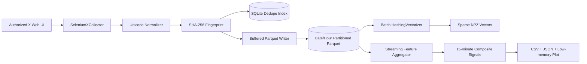

# Technical Design

## 1. Objective

Build a maintainable data pipeline for near-real-time Indian stock-market discussion analysis. The system collects authorized X posts, cleans multilingual text, removes duplicates, stores columnar records, produces sparse text vectors, and aggregates posts into interpretable market signals with uncertainty estimates.

## 2. Architecture

### Module boundaries

- `collectors`: source-specific page navigation and extraction only
- `processing`: source-independent normalization and fingerprinting
- `storage`: persistence and deduplication
- `analysis`: text features, vectors, aggregation, confidence, visualization
- `pipeline`: orchestration and lifecycle management
- `cli`: reproducible user-facing commands

This separation allows the X adapter to be replaced without changing downstream logic.

## 3. Collection strategy

The collector opens X's latest-search UI for one hashtag at a time and extracts only rendered posts. A dedicated, manually authenticated Chrome profile is reused. It uses Selenium WebDriver, explicit document readiness checks, bounded page-load retries, bounded scroll counts, and a no-progress circuit breaker.

The implementation deliberately avoids:

- CAPTCHA solving or bypass
- stealth WebDriver patches
- browser fingerprint spoofing
- residential/datacenter proxy rotation
- account farming
- reverse-engineered private endpoints
- attempts to defeat rate limits or platform controls

The collector is disabled unless `X_SCRAPING_AUTHORIZED=true` is explicitly set.

### Failure handling

| Failure | Behavior |
|---|---|
| Login redirect | Stop with an actionable error |
| Page timeout | Retry with bounded exponential backoff |
| Stale DOM node | Skip the node and continue |
| Individual parse failure | Log and continue |
| Repeated no new records | Stop the current query |
| Browser shutdown error | Log without hiding the pipeline result |

## 4. Data model and storage

### Why Parquet

Parquet is columnar, compressible, supports predicate pruning, stores nested lists for mentions and hashtags, and is well suited to analytical scans. Data is compressed with Zstandard, dictionary encoded, and partitioned by event date/hour.

### Why SQLite for the dedupe index

A Parquet file is optimized for scans rather than point lookups. A small SQLite sidecar provides a durable unique index over SHA-256 fingerprints. It uses WAL mode and `INSERT OR IGNORE`, making restarts idempotent while preserving Parquet as the primary analytical store.

### Fingerprint hierarchy

1. Preferred: SHA-256 of the source post identifier.
2. Fallback: SHA-256 of normalized username, UTC minute, and normalized content.

The fallback tolerates minor formatting variation but cannot perfectly distinguish two identical posts from the same user in one minute.

## 5. Unicode and Indian-language handling

The normalizer applies Unicode NFKC, removes zero-width characters and unsafe control characters, collapses whitespace, and preserves Devanagari, other Unicode letters, punctuation, hashtags, mentions, and emoji. A lightweight language hint classifies content as Indic, Romanized/English, mixed, or unknown without forcing transliteration.

This avoids destructive ASCII-only cleaning, which would remove much of the relevant Indian-language signal.

## 6. Text-to-signal conversion

### Sparse numerical vectors

`HashingVectorizer` creates unigram/bigram sparse vectors in fixed dimensionality. Unlike vocabulary-based TF-IDF, hashing does not require fitting or retaining a global vocabulary. It therefore supports continuous processing with predictable memory usage. Each record batch is saved independently as compressed CSR `.npz`, with a sidecar list mapping matrix rows to post IDs.

Hash collisions are the principal trade-off. Increasing `n_features` reduces collisions at the cost of larger matrices.

### Interpretable finance features

The custom feature layer calculates:

- bullish-term count
- bearish-term count
- negation-adjusted polarity
- excessive-uppercase ratio
- exclamation count
- manipulation-risk phrase score
- logarithmic engagement and reach
- exponential recency decay

The per-post signal is bounded to `[-1, +1]`. Manipulation-risk language reduces both the signal magnitude and its aggregation weight.

### Aggregation and confidence interval

Posts are grouped by inferred market tag and 15-minute UTC window. For each group the system tracks only:

- count
- weight sum
- weighted signal sum
- weighted squared signal sum
- engagement sum
- directional counts
- a set of unique authors

The weighted variance yields a normal-approximation 95% confidence interval. A confidence score combines sample size, author diversity, and interval width. This is computationally inexpensive and explainable, though a bootstrap or Bayesian model could provide stronger uncertainty estimates in a larger production system.

## 7. Indian-market considerations

- `#banknifty` and `#nifty50` discussions can be dominated by derivatives and intraday positioning.
- Engagement is not equivalent to predictive value; logarithmic scaling prevents a single viral account from dominating.
- “Sure shot,” “operator,” “upper circuit,” and “double money” language can indicate promotional or manipulation risk and is discounted.
- Hindi, English, and Romanized Hinglish frequently coexist in one post.
- Market-open, expiry-day, RBI, budget, election, and global-risk events can change volume and language distribution abruptly.
- A social signal should be joined with price, volume, volatility, and market-calendar features before any serious predictive evaluation.

## 8. Complexity

Let `N` be the number of posts, `L` average text length, `F` vector dimensions, and `W` aggregate windows.

| Operation | Time | Memory |
|---|---:|---:|
| Normalize and extract tokens | `O(NL)` | `O(L)` per record |
| Local duplicate membership | average `O(1)` | `O(N)` within one run |
| Persistent dedupe insert | approximately `O(log N)` | SQLite-managed |
| Buffered Parquet write | `O(N)` | `O(batch_size)` |
| Sparse hashing | `O(total tokens)` | `O(batch non-zeros)` |
| Window aggregation | `O(N)` | `O(W + unique authors/window)` |
| Plotting | `O(W)` | bounded sampled points |

For exactly 2,000 posts, these costs are modest. The design remains bounded when processing 20,000 or more posts because text vectors and Parquet writes are batched.

## 9. Scaling to 10x and beyond

1. Store Parquet in S3-compatible object storage and partition by date/hour/market.
2. Replace local SQLite with PostgreSQL, Redis, or a Bloom-filter-plus-durable-index design for multiple collectors.
3. Place normalized records on Kafka, Redpanda, or a cloud queue.
4. Run collectors independently from processors.
5. Use DuckDB/Polars for one-machine analytics or Spark/Ray for distributed scans.
6. Persist model and lexicon versions with every output.
7. Add idempotent checkpoints and a dead-letter queue.
8. Monitor posts/minute, parse-error rate, duplicate rate, lag, storage bytes, and signal drift.

## 10. Production observability

JSON logs include timestamp, level, logger, message, attempt, query, count, and path where applicable. A production deployment should additionally export metrics to Prometheus/OpenTelemetry and define alerts for prolonged zero-yield collection, schema drift, unusually high duplicate rates, and data freshness breaches.

## 11. Security and privacy

- No credentials are committed.
- The Chrome profile remains local and is configured only by environment variable.
- Raw data should have a retention policy.
- Public handles should not be enriched with private personal data.
- Access to raw posts and browser profiles should be least-privilege.
- Generated market signals must be labeled as research output, not financial advice.

## 12. Validation approach

The repository includes:

- Unicode normalization tests
- stable fingerprint test
- compact engagement-count parser tests
- bullish/bearish feature tests
- manipulation-risk discount test
- recency-weight test
- SQLite dedupe test
- full sample-to-Parquet-to-signal-to-vector integration test

The checked-in sample data is synthetic and clearly labeled; it is used to make the repository reproducible without violating platform access restrictions.
